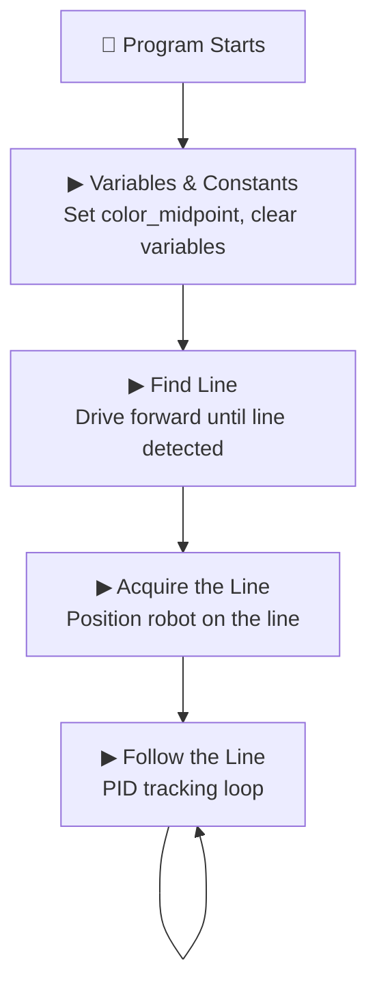
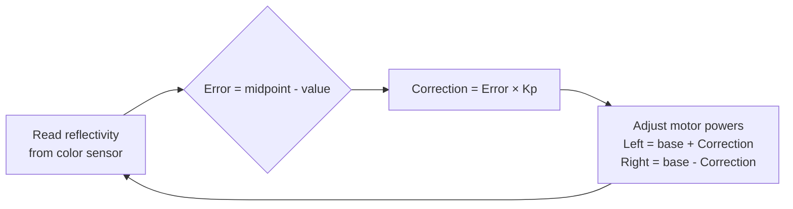

# Line-Following Robot

A line-following robot built as the second project for the school showcase. Adapted from a coursework project I had built for my own Robotics class — scaled down in scope and complexity to work with the LEGO SPIKE Prime kit and sensors available.

## Programs

### Line_Following.llsp3 — "Benito" (84 blocks)
Original version built with `flippermotor` blocks (speed-based motor control). Movement on ports EF, color sensor on port B, distance sensor on port D.

### Line_Following_mid1.llsp3 — "Diddy" (95 blocks)
Tuned version with `flippermoremotor` (power-based individual motor control). Movement on ports CD, color sensor on port A, distance sensor on port F. Non-zero PID variables (Error=-22.5, Correction=-13.5) confirm it was field-tested and tuned.

## Program Flow

Both versions follow the same structure:

### PID Loop Detail

### Procedure Breakdown

**Variables and Constants** — Sets `color_midpoint=58.5`, initializes `motor_left`, `motor_right`, `Error`, `Correction`, `sensor_color`, `sensor_distance`

**Find Line** — Sets movement ports, starts moving forward, waits until line is detected under the sensor, then stops

**Acquire the Line** — Resets timer, repeats until the robot is properly positioned on the line, then stops

**Follow the Line / Follow the Line 1** — Forever loop containing the PID control logic:
- Reads reflectivity from the color sensor
- Compares against the midpoint to calculate `Error`
- Computes `Correction` using PID math (proportional term)
- Adjusts left and right motor power independently to steer back to the line

## PID Control

I used this project to introduce the scholars to **PID controllers** — a fundamental engineering concept. Rather than a bang-bang approach (hard left/hard right), the robot uses proportional correction to follow the line smoothly. The scholars didn't need to master the math, but they learned that there's a difference between something that *works* and something that's *tuned*.

## Track

We built the track ourselves — black tape on white paper with red markers at the start and end. The scholars laid out the course and tested the robot under real showcase conditions.

## Video

| File | Description |
|------|-------------|
| `videos/IMG_4684.mp4` | Line-following robot demo — tracking black line, red markers signal start/end |
