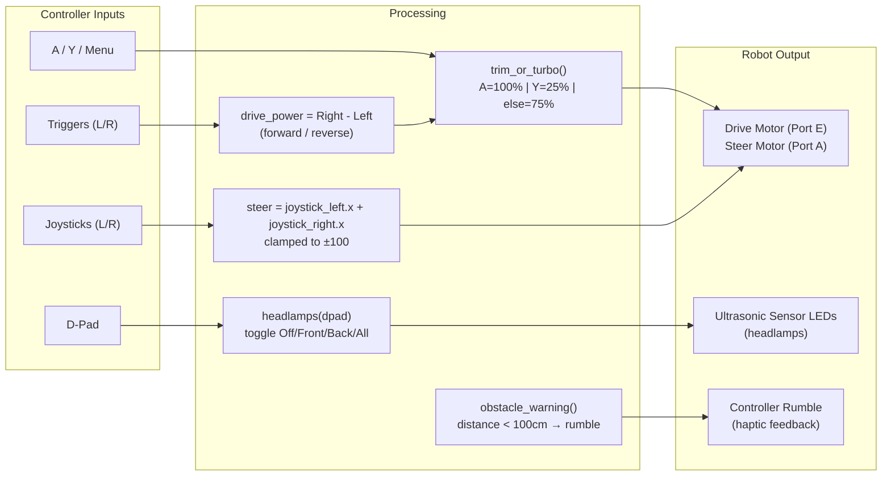

# Project Car — LEGO SPIKE Prime RC Car

A LEGO SPIKE Prime car inspired by a TikTok video of someone's project car. Built by a group of robotics scholars under my guidance for a school showcase.

## Programs

### `ball_bot_with_class.py`
Xbox controller-controlled RC car using Pybricks. Features:
- Dual trigger drive (right trigger forward, left trigger reverse)
- Dual joystick steering (combined left + right horizontal)
- Trim/Turbo modes: A button = full power, Y button = 25% power, default = 75%
- Scholar mode config via hub buttons (LEFT = "good", RIGHT = "experiment")

### `car_devine.py`
Enhanced version with additional features:
- **Two scholar modes**: "good" (ultrasonic sensor on port C, green light) and "experiment" (no ultrasonic, red light)
- **Headlamp control**: 4 modes via D-pad — Off, Front lights, Back lights, All lights
- **Obstacle warning**: Ultrasonic sensor triggers controller rumble when within 100cm (intensity increases as distance decreases)
- **Port auto-detection**: Scans ports for connected devices on startup

### Control Flow

## Build Process

| Stage | Image |
|-------|-------|
| Early build — rear wheel drive and gear setup | `images/IMG_5153.HEIC`, `IMG_5155.HEIC`, `IMG_5156.HEIC` |
| Driving motor close-up | `images/IMG_5154.HEIC` |
| Almost complete — waiting on ultrasonic sensors (headlights) | `images/IMG_5152.HEIC` |
| Finished robot | `images/IMG_5157.HEIC`, `IMG_5122.jpg` |

## Videos

| File | Description |
|------|-------------|
| `videos/IMG_4618.mov` | Ultrasonic sensor headlight demo — 4 modes: Off, Low, High, All |
| `videos/IMG_5159.mov` | Students racing the finished cars |

## Reference

Screenshots from the TikTok video that inspired the build — an IRL project car suggested by a scholar.

| File |
|------|
| `reference/Screenshot 2025-03-10 231940.png` |
| `reference/Screenshot 2025-03-10 232014.png` |
| `reference/Screenshot 2025-03-10 232034.png` |
