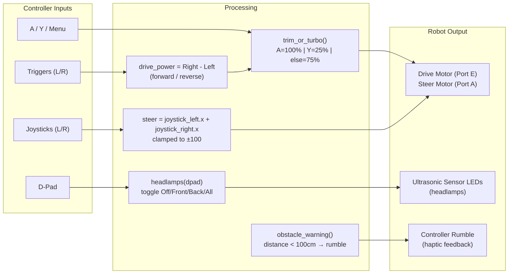
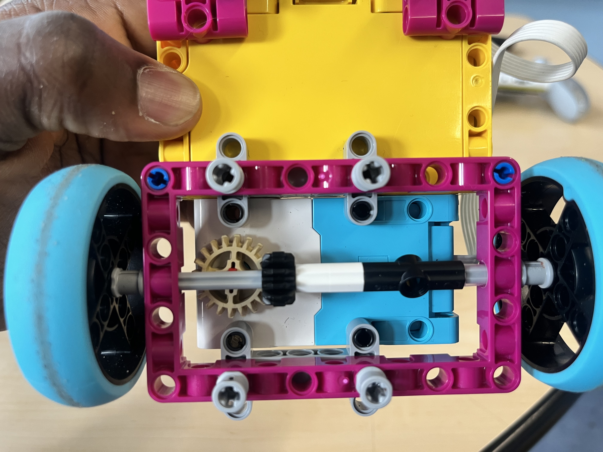
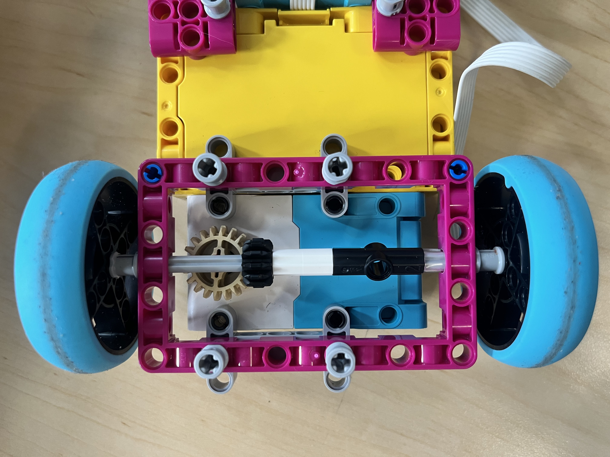
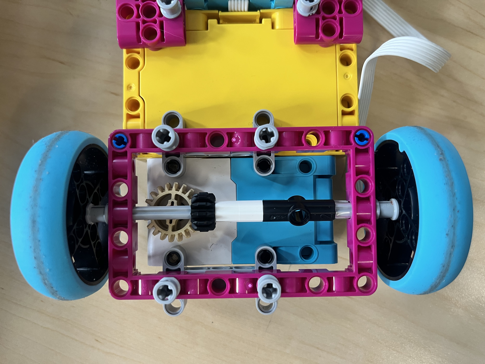
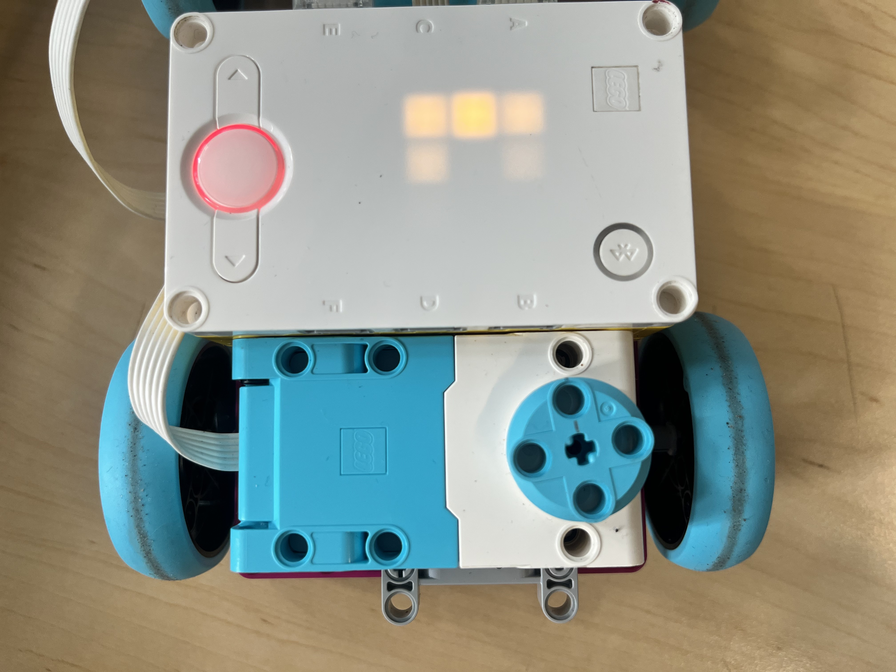
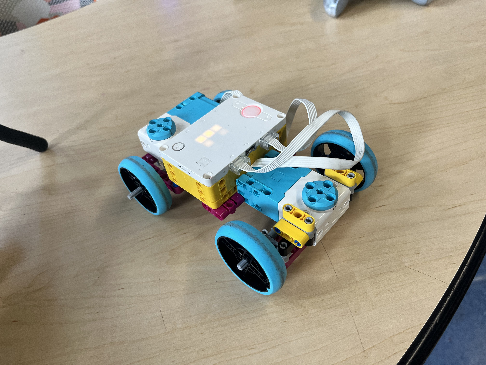
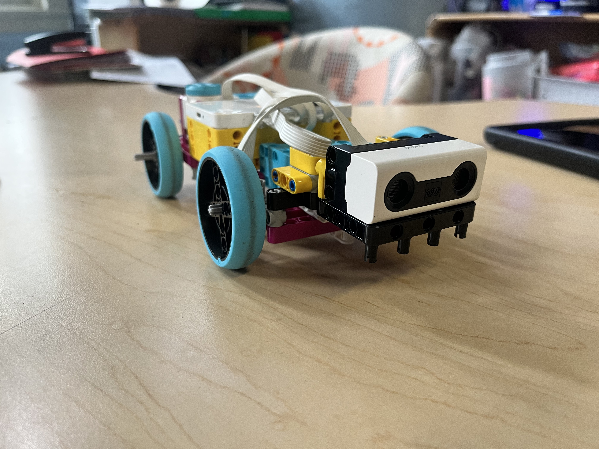

# Project Car — LEGO SPIKE Prime RC Car

A LEGO SPIKE Prime car inspired by a TikTok video of someone's project car. Built by a group of robotics scholars under my guidance for a school showcase.

## Programs

### `car_devine.py`
Enhanced RC car with:
- **Two scholar modes**: "good" (ultrasonic sensor on port C, green light) and "experiment" (no ultrasonic, red light)
- **Headlamp control**: 4 modes via D-pad — Off, Front lights, Back lights, All lights
- **Obstacle warning**: Ultrasonic sensor triggers controller rumble when within 100cm (intensity increases as distance decreases)
- **Port auto-detection**: Scans ports for connected devices on startup

### Control Flow

## Build Process

| Stage | Image |
|-------|-------|
| Early build — rear wheel drive and gear setup |    |
| Driving motor close-up |  |
| Almost complete — waiting on ultrasonic sensors (headlights) |  |
| Finished robot |  |

## Videos

### Headlight Demo
Ultrasonic sensor headlight demo — 4 modes: Off, Low, High, All.

<video src="videos/IMG_4618 (2).mp4" width="600" controls></video>

*Headlight demo*

### Racing
Students racing the finished cars.

<video src="videos/IMG_5159.mp4" width="600" controls></video>

*Scholars racing the finished cars*

## Reference

Screenshots from the TikTok video that inspired the build — an IRL project car suggested by a scholar.

*Design inspiration from TikTok/YouTube*
