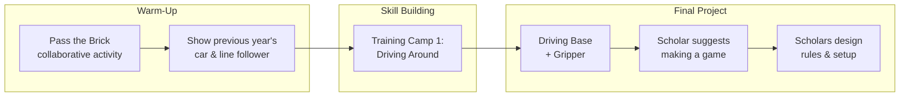
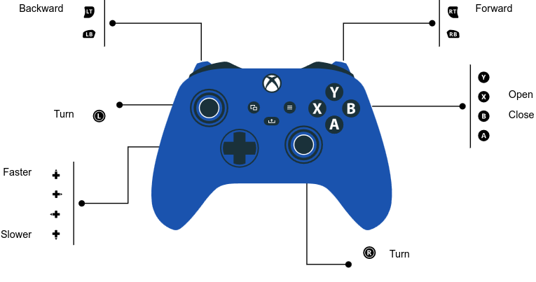
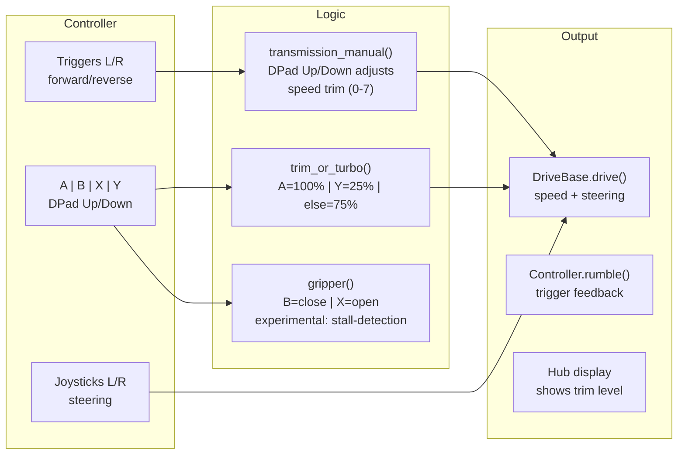
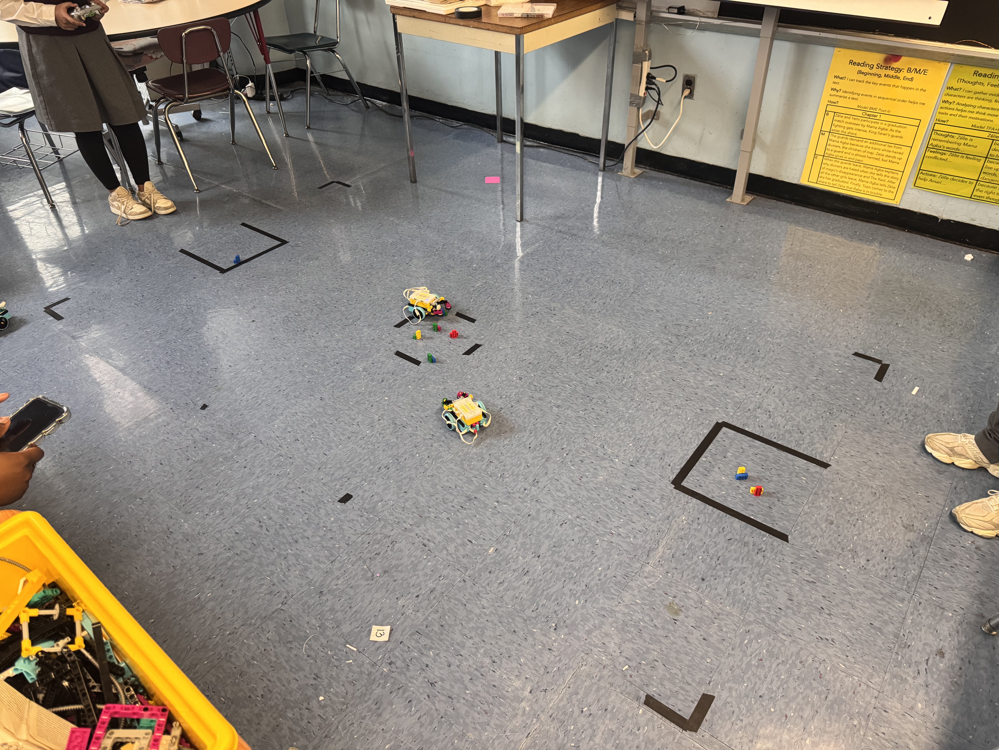
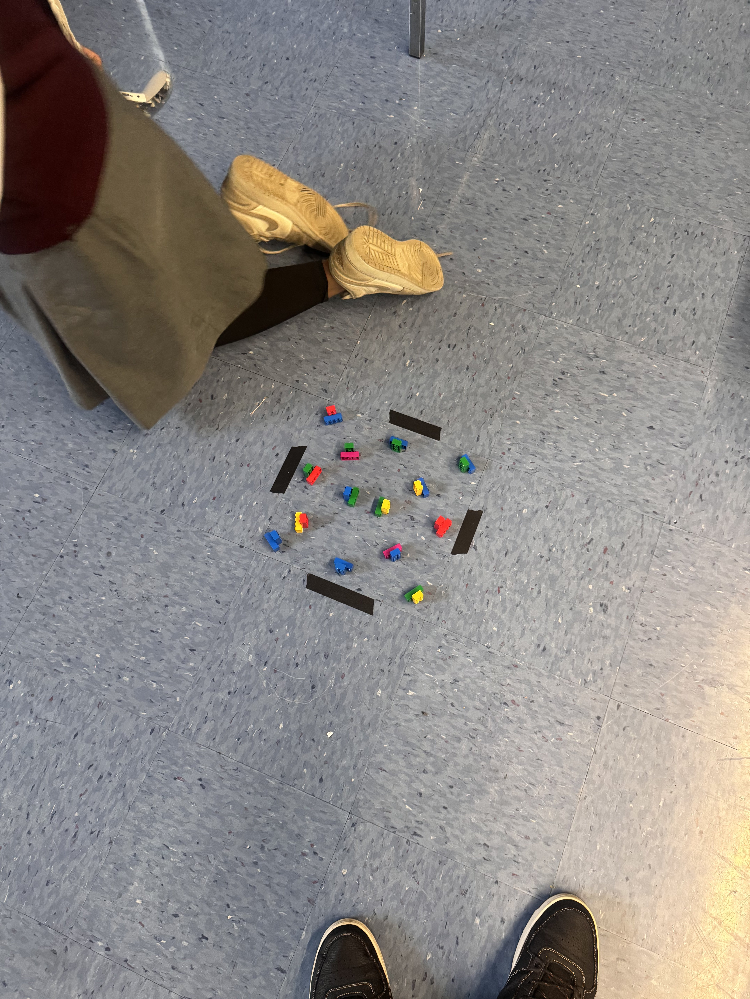
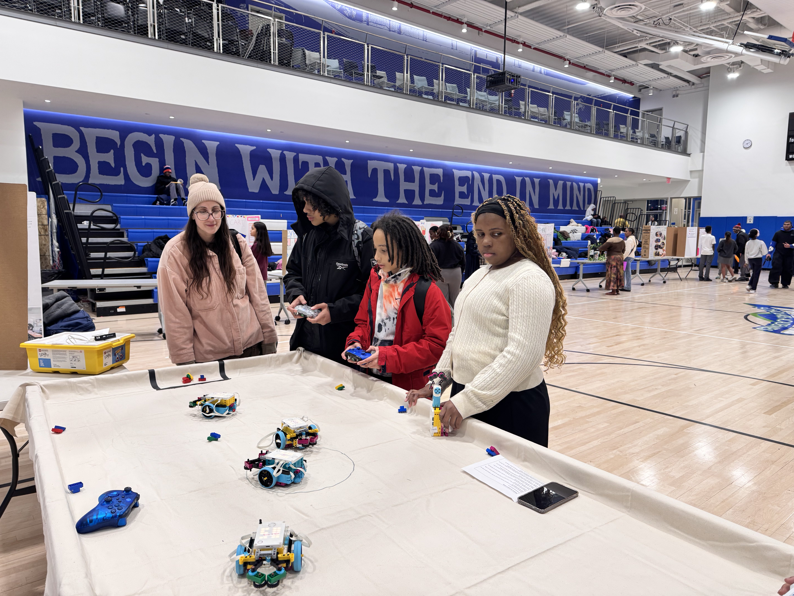
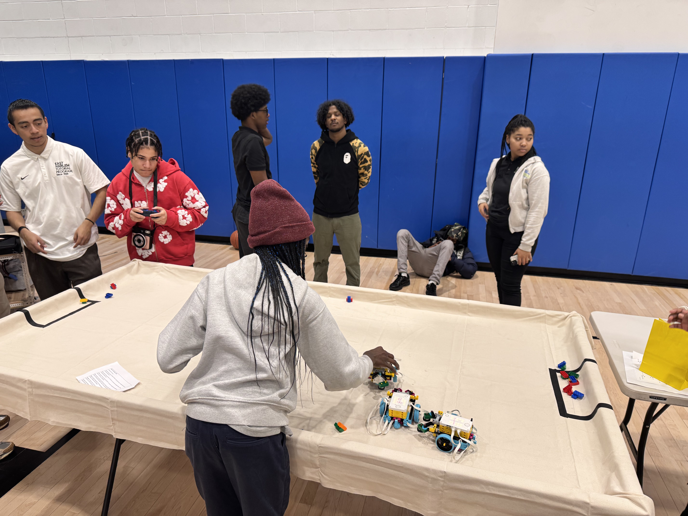
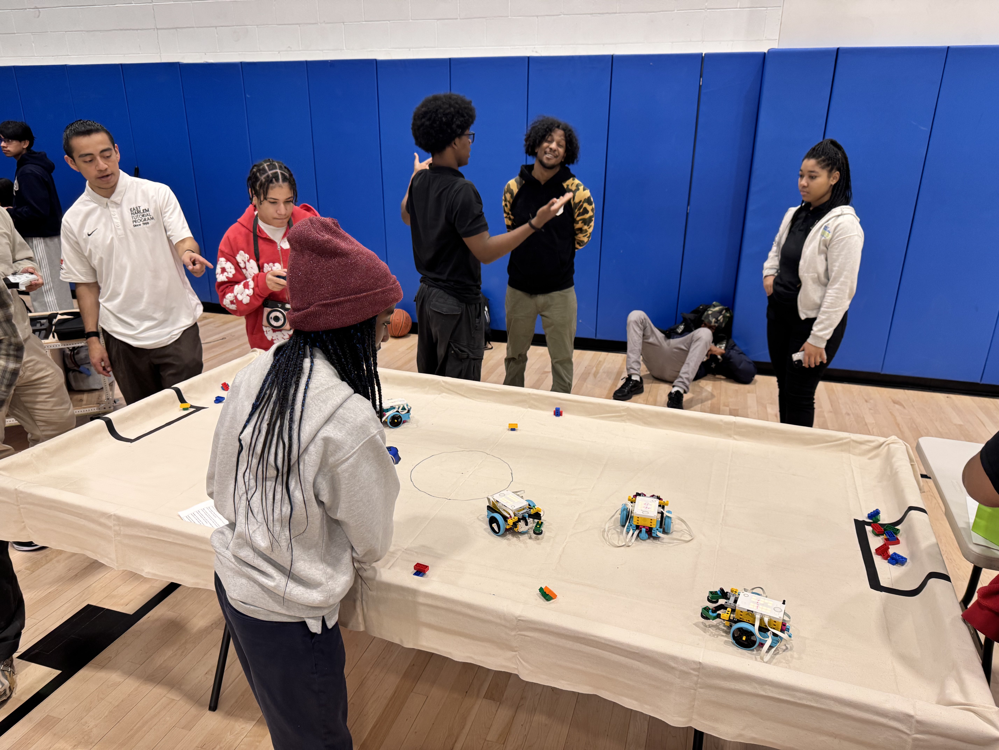
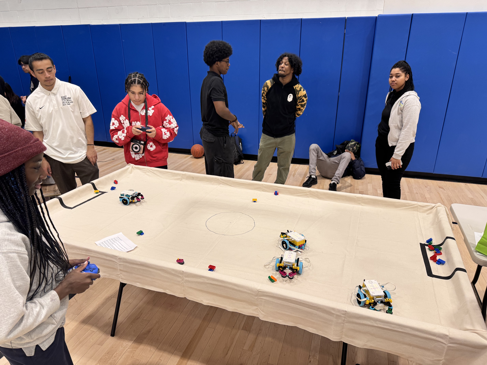
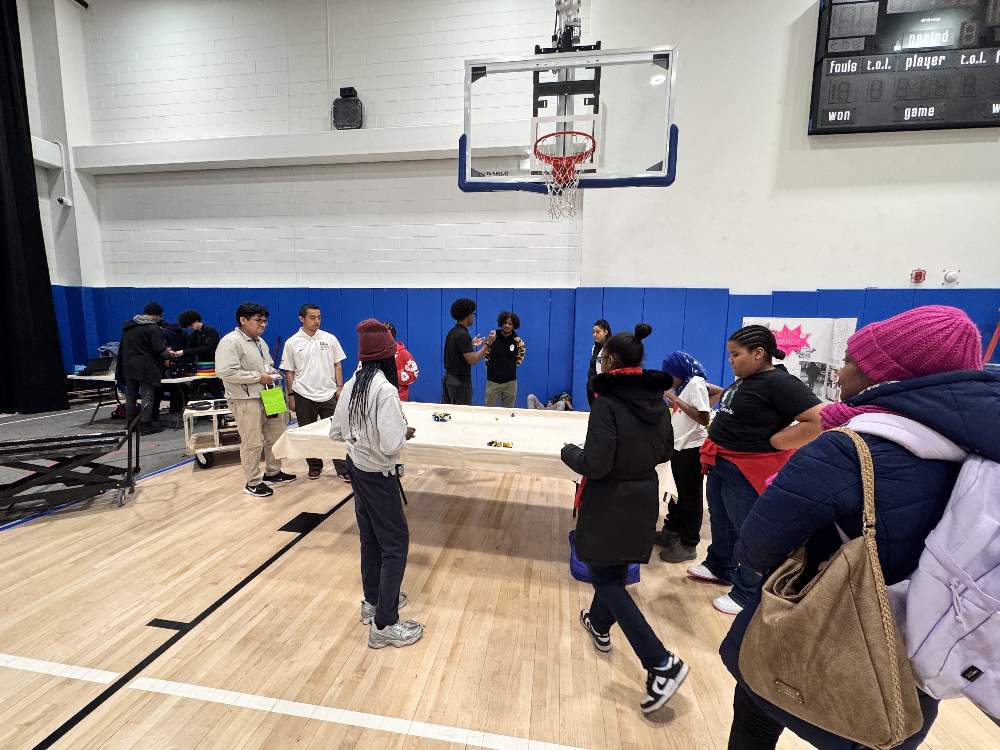

# 2025-2026 — Driving Base with Gripper

A new cohort, more gender-diverse, and a project that grew from simple lessons into a game designed by the scholars themselves.

---

## The Journey

### 1. Pass the Brick

I started the scholars with a simple collaborative activity — [Pass the Brick](https://education.lego.com/en-us/lessons/prime-extra-resources/pass-the-brick/). No complex code, just teamwork and getting comfortable with the robots. They loved it.

### 2. Inspiration from Last Year

Once they were comfortable, I showed them what the 2024-2025 cohort had built — the RC car and the line-following robot. They saw where this was headed and were eager to get there.

### 3. Training Camp 1: Driving Around

We worked through [Training Camp 1 — Driving Around](https://education.lego.com/en-us/lessons/prime-competition-ready/training-camp-1-driving-around/), a structured lesson on controlling a driving base. They picked it up fast, and I made sure to acknowledge every win — the first straight line, the first turn without crashing.

### 4. Driving Base + Gripper

The final project: combining a driving base with a gripper. Not just moving, but interacting — grabbing, carrying, and manipulating objects.

---

## Programs

### `DriveBase_1.py`

Xbox controller-controlled driving base with gripper, built with Pybricks.

**Hardware setup:**
- Left motor: Port C (counterclockwise)
- Right motor: Port D
- Gripper motor: Port E
- Drive base: 56mm wheels, 112mm axle track

*Xbox controller button layout*

**Control flow:**

**Features:**
- **Transmission**: D-pad up/down adjusts speed trim (0-7), shown on hub display
- **Gripper modes**: "sure" (position-targeted) and "experimental" (stall-detected with rumble feedback)
- **Rumble feedback**: Triggers vibrate based on forward/reverse power
- **Multiple shutdown buttons**: Center, View, Menu, Guide, Upload, LB, RB all shut down the hub
- **Trim/Turbo**: Same system as previous year — A for full power, Y for 25%, default 75%

---

## The Game

After adding the gripper, one of the scholars suggested turning it into a **game**. I showed them how to set up the controllers, then stepped back and let them figure out the rules and the setup themselves. They owned it from there.

*Scholars setting up the game*

### Driving Base with Gripper Test

{::nomarkdown}<video src="driving-base-gripper/videos/IMG_7536.mp4" width="600" controls></video>{:/nomarkdown}

*Testing the drive base with gripper*

### Game Play

{::nomarkdown}<video src="driving-base-gripper/videos/IMG_7743.mp4" width="600" controls></video>{:/nomarkdown}

*Scholars trying out the game*

### Drawing with the Robot

{::nomarkdown}<video src="driving-base-gripper/videos/IMG_9262.mp4" width="600" controls></video>{:/nomarkdown}

*Drawing with the robot*

---

## Showcase

Staff, parents, and scholars from other schools came to see the game and robot built by the Robotics scholars.

*Visitors engaging with the project at the showcase*
