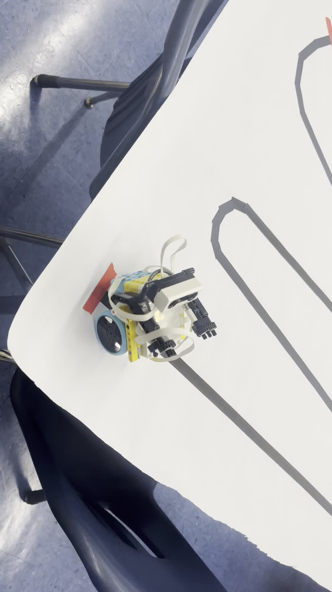

# Building More Than Robots

A two-year journey building LEGO SPIKE Prime robots with scholars — from an RC car inspired by a TikTok video, to a PID line-follower, to a gripper game designed by the scholars themselves.

---

## 2024-2025

### The Project Car

A scholar pulled out his Chromebook and showed a TikTok video of someone's project car. The other scholars leaned in. They liked it.

I asked them to find LEGO builds similar to what they saw. Over the next few sessions, we built it piece by piece — rear drive, steering, motors, and ultrasonic sensors that doubled as headlights.

<video src="2024-2025/project-car/videos/IMG_5159.mp4" controls></video>

When the hardware was done, I walked them through the Python programming and controller setup.

[▶ Project Car details &rarr;](2024-2025/project-car/README.md)

---

### The Line-Following Robot

I showed them a project I had built for my own Robotics coursework — a line-following robot. They wanted to build their own.

I adapted it for the LEGO kit, stripped it down to the essentials, and used it to introduce a core engineering concept: the **PID controller**. They didn't need to master the math — just understand that there's a difference between something that *works* and something that's *tuned*.

We built the track ourselves: black tape on white paper, red markers at the start and end.

<video src="2024-2025/line-follower/videos/IMG_4684.mp4" controls></video>

[▶ Line Follower details &rarr;](2024-2025/line-follower/README.md)

---

## 2025-2026

A new year. A new cohort — more gender-diverse. I started them with simple collaborative activities, then showed them what the previous year's scholars had built.

They worked through driving basics, then graduated to a **driving base with a gripper**. After we added the gripper, one of the scholars suggested making a **game** out of it. I showed them how to set up the controllers, then stepped back and let them figure out the rules themselves.

<video src="2025-2026/driving-base-gripper/videos/IMG_7536.mp4" controls></video>
<video src="2025-2026/driving-base-gripper/videos/IMG_7743.mp4" controls></video>
<video src="2025-2026/driving-base-gripper/videos/IMG_9262.mp4" controls></video>

The showcase brought staff, parents, and scholars from other schools to see what they had built.

[▶ 2025-2026 details &rarr;](2025-2026/README.md)

---

## Files

| Category | Links |
|----------|-------|
| Full index | [`Files.md`](Files.md) |
| Project car code | `car_devine.py` |
| Line follower | `Line_Following.llsp3` · `Line_Following_mid1.llsp3` |
| Driving base | `DriveBase_1.py` |
| Project car reference | [`project-car/reference/`](2024-2025/project-car/reference/) |
| Project car images | [`project-car/images/`](2024-2025/project-car/images/) |
| Project car videos | [`project-car/videos/`](2024-2025/project-car/videos/) |
| Line follower media | [`line-follower/videos/`](2024-2025/line-follower/videos/) |
| 2025-2026 media | [`driving-base-gripper/`](2025-2026/driving-base-gripper/) |
| Showcase photos | [`showcase/images/`](2025-2026/showcase/images/) |

---

*Scholars who walked in not knowing what to expect, and walked out having built something they were proud of. I just helped them find the way.*
