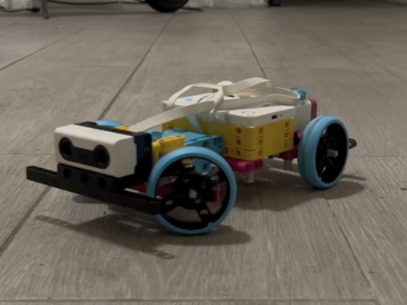

# Building More Than Robots

A two-year journey building LEGO SPIKE Prime robots with scholars, from an RC car inspired by a TikTok video, to a PID line-follower, to a gripper game designed by the scholars themselves.

---

## 2024-2025

### The Project Car

A scholar pulled out his Chromebook and showed a TikTok video of someone's project car. The other scholars leaned in. They liked it.

*The TikTok video that sparked the project*

I asked them to find LEGO builds similar to what they saw. Over the next few sessions, we built it piece by piece: rear drive, steering, motors, and ultrasonic sensors that doubled as headlights.

 

*Rear wheel drive and gear setup*

*Almost complete, waiting on the ultrasonic sensors*

 

*The finished robot*

When the hardware was done, I walked them through the Python programming and controller setup. We tested the ultrasonic sensors configured as headlights, cycling through four modes: Off, Low, High, and All lights. Seeing the car respond to their code, lighting up on command, was the moment it all clicked for them.

{::nomarkdown}<video src="../2024-2025/project-car/videos/IMG_4618%20(2).mp4" width="600" controls></video>{:/nomarkdown}

*Headlight demo*

Then came the best part: we lined up the cars and let the scholars race what they built.

{::nomarkdown}<video src="../2024-2025/project-car/videos/IMG_5159.mp4" width="600" controls></video>{:/nomarkdown}

*Scholars racing the finished cars*

[▶ Project Car details &rarr;](../2024-2025/project-car/README.md)

---

### The Line-Following Robot

I showed them a project I had built for my own Robotics coursework, a line-following robot. They wanted to build their own.

I adapted it for the LEGO kit, stripped it down to the essentials, and used it to introduce a core engineering concept: the **PID controller**. They didn't need to master the math; they just needed to understand the difference between something that *works* and something that's *tuned*.

We built the track ourselves: black tape on white paper, red markers at the start and end.

{::nomarkdown}<video src="../2024-2025/line-follower/videos/IMG_4684.mp4" width="600" controls></video>{:/nomarkdown}

*Line-following robot tracking the course*

[▶ Line Follower details &rarr;](../2024-2025/line-follower/README.md)

---

## 2025-2026

A new year, a new cohort, more gender-diverse. For the upcoming showcase, I wanted something that would appeal to as many scholars as possible.

I started them with a simple LEGO Education lesson called [Pass the Brick](https://education.lego.com/en-us/lessons/prime-extra-resources/pass-the-brick/), a collaborative activity where they pass a LEGO brick around using the robot. No complex code, just teamwork and a taste of what the machines could do. They loved it.

Once they were comfortable, I showed them what the previous cohort had built: the car and the line-following robot. They could see where this was headed, and they were eager to get there.

I then had them work through [Training Camp 1 — Driving Around](https://education.lego.com/en-us/lessons/prime-competition-ready/training-camp-1-driving-around/), a structured lesson on controlling a driving base. They picked it up fast, and I made sure to acknowledge every win: the first straight line, the first turn without crashing.

Then came the final project: combining a **driving base with a gripper**. Not just moving, but interacting: grabbing, carrying, and manipulating objects.

{::nomarkdown}<video src="../2025-2026/driving-base-gripper/videos/IMG_7536.mp4" width="600" controls></video>{:/nomarkdown}

*Testing the drive base with gripper*

After we added the gripper, one of the scholars suggested making a **game** out of it. I showed them how to set up the controllers, then stepped back and let them figure out the rules and the setup themselves. They owned it from there.

*Scholars setting up the game*

{::nomarkdown}<video src="../2025-2026/driving-base-gripper/videos/IMG_7743.mp4" width="600" controls></video>{:/nomarkdown}

*Scholars trying out the game*

They even figured out they could attach a marker and make the robot draw.

{::nomarkdown}<video src="../2025-2026/driving-base-gripper/videos/IMG_9262.mp4" width="600" controls></video>{:/nomarkdown}

*Drawing with the robot*

The showcase brought staff, parents, and scholars from other schools to see what they had built.

*Visitors engaging with the project at the showcase*

[▶ 2025-2026 details &rarr;](../2025-2026/README.md)

---

## Files

| Category | Links |
|----------|-------|
| Full index | [`Files.md`](../Files.md) |
| Project car code | [`car_devine.py`](../2024-2025/project-car/car_devine.py) |
| Line follower | [`Line_Following.llsp3`](../2024-2025/line-follower/Line_Following.llsp3) · [`Line_Following_mid1.llsp3`](../2024-2025/line-follower/Line_Following_mid1.llsp3) |
| Driving base | [`DriveBase_1.py`](../2025-2026/DriveBase_1.py) |
| Project car reference | [`project-car/reference/`](../2024-2025/project-car/reference/) |
| Project car images | [`project-car/images/`](../2024-2025/project-car/images/) |
| Project car videos | [`project-car/videos/`](../2024-2025/project-car/videos/) |
| Line follower media | [`line-follower/videos/`](../2024-2025/line-follower/videos/) |
| 2025-2026 media | [`driving-base-gripper/`](../2025-2026/driving-base-gripper/) |
| Showcase photos | [`showcase/images/`](../2025-2026/showcase/images/) |

---

*Scholars who walked in not knowing what to expect, and walked out having built something they were proud of. I just helped them find the way.*
